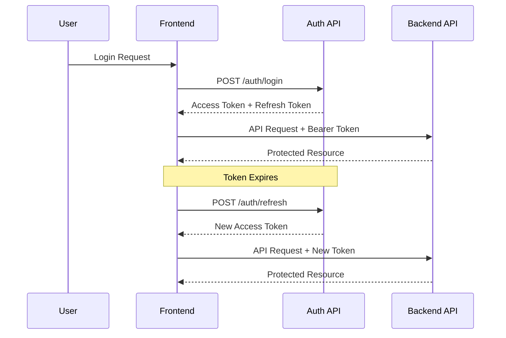

# Authentication API

The Order Management System uses **JWT (JSON Web Tokens)** for secure authentication with automatic token refresh.

## 🔐 Authentication Flow



## 📚 Endpoints

### Register User

Register a new user account.

**`POST /auth/register`**

=== "Request"
    ```json
    {
      "email": "user@example.com",
      "senha": "securepassword123",
      "nome": "John Doe"
    }
    ```

=== "Response"
    ```json
    {
      "mensagem": "Usuário criado com sucesso",
      "usuario": {
        "id": 1,
        "email": "user@example.com",
        "nome": "John Doe"
      }
    }
    ```

=== "cURL"
    ```bash
    curl -X POST "http://localhost:8000/auth/register" \
      -H "Content-Type: application/json" \
      -d '{
        "email": "user@example.com",
        "senha": "securepassword123",
        "nome": "John Doe"
      }'
    ```

### Login

Authenticate user and receive JWT tokens.

**`POST /auth/login`**

=== "Request"
    ```json
    {
      "email": "user@example.com",
      "senha": "securepassword123"
    }
    ```

=== "Response"
    ```json
    {
      "access_token": "eyJhbGciOiJIUzI1NiIsInR5cCI6IkpXVCJ9...",
      "refresh_token": "eyJhbGciOiJIUzI1NiIsInR5cCI6IkpXVCJ9...",
      "token_type": "bearer",
      "expires_in": 7200
    }
    ```

=== "cURL"
    ```bash
    curl -X POST "http://localhost:8000/auth/login" \
      -H "Content-Type: application/json" \
      -d '{
        "email": "user@example.com",
        "senha": "securepassword123"
      }'
    ```

### Refresh Token

Get a new access token using refresh token.

**`POST /auth/refresh`**

=== "Request"
    ```bash
    # Headers
    Authorization: Bearer <refresh_token>
    ```

=== "Response"
    ```json
    {
      "access_token": "eyJhbGciOiJIUzI1NiIsInR5cCI6IkpXVCJ9...",
      "token_type": "bearer",
      "expires_in": 7200
    }
    ```

=== "cURL"
    ```bash
    curl -X POST "http://localhost:8000/auth/refresh" \
      -H "Authorization: Bearer <your_refresh_token>"
    ```

### Get Current User

Get information about the authenticated user.

**`GET /auth/me`**

=== "Request"
    ```bash
    # Headers
    Authorization: Bearer <access_token>
    ```

=== "Response"
    ```json
    {
      "id": 1,
      "email": "user@example.com",
      "nome": "John Doe",
      "is_admin": false
    }
    ```

=== "cURL"
    ```bash
    curl -X GET "http://localhost:8000/auth/me" \
      -H "Authorization: Bearer <your_access_token>"
    ```

## 🔧 Token Management

### Token Structure

JWT tokens contain user information and permissions:

```json
{
  "sub": "1",           // User ID
  "email": "user@example.com",
  "nome": "John Doe",
  "is_admin": false,
  "exp": 1640995200,    // Expiration timestamp
  "iat": 1640988000     // Issued at timestamp
}
```

### Token Expiration

| Token Type | Expiration | Purpose |
|------------|------------|---------|
| **Access Token** | 2 hours | API access |
| **Refresh Token** | 7 days | Token renewal |

### Frontend Token Storage

Tokens are stored in JSON format with metadata:

```json
{
  "token": "eyJhbGciOiJIUzI1NiIsInR5cCI6IkpXVCJ9...",
  "created_at": "2023-12-01T10:30:00.000000",
  "type": "access_token"
}
```

## 🛡️ Security Features

### Protection Mechanisms

- **Password Hashing**: bcrypt with salt
- **Token Signing**: HMAC-SHA256 algorithm
- **Token Expiration**: Automatic expiry
- **Refresh Rotation**: New tokens on refresh
- **Secure Headers**: CORS and security headers

### Best Practices

!!! tip "Security Recommendations"
    - Use HTTPS in production
    - Store tokens securely
    - Implement token rotation
    - Monitor authentication attempts
    - Use strong passwords

## 🔍 Error Handling

### Common Errors

| Status Code | Error | Description |
|-------------|--------|-------------|
| `400` | Bad Request | Invalid request format |
| `401` | Unauthorized | Invalid credentials |
| `403` | Forbidden | Insufficient permissions |
| `422` | Validation Error | Invalid input data |
| `500` | Internal Error | Server error |

### Example Error Response

```json
{
  "detail": "Invalid credentials",
  "error_code": "AUTH_FAILED",
  "timestamp": "2023-12-01T10:30:00.000000"
}
```

## 🧪 Testing Authentication

### Using Frontend

1. **Register**: Create account via Streamlit
2. **Login**: Authenticate and receive tokens
3. **Monitor**: Check token status in sidebar
4. **Refresh**: Automatic token renewal

### Using API Directly

```python
import httpx

# Login
response = httpx.post("http://localhost:8000/auth/login", json={
    "email": "user@example.com",
    "senha": "password"
})

tokens = response.json()
access_token = tokens["access_token"]

# Use token for API calls
headers = {"Authorization": f"Bearer {access_token}"}
response = httpx.get("http://localhost:8000/auth/me", headers=headers)
```

---

**Next:** [Orders API](orders.md) 📦