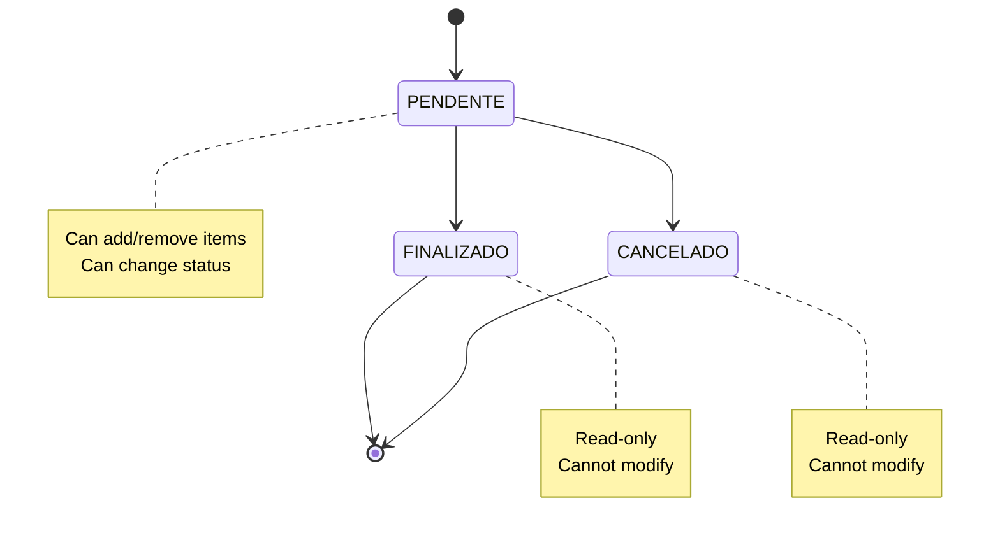

# Orders API

Manage orders with full CRUD operations, status tracking, and item management.

## 📦 Order Management

### Order States



## 🔗 Endpoints

### Create Order

Create a new order for the authenticated user.

**`POST /pedidos/pedido`**

=== "Request"
    ```json
    {
      "usuario": 1
    }
    ```

=== "Response"
    ```json
    {
      "mensagem": "Pedido criado com sucesso. ID do pedido: 27",
      "pedido_id": 27,
      "status": "PENDENTE"
    }
    ```

=== "cURL"
    ```bash
    curl -X POST "http://localhost:8000/pedidos/pedido" \
      -H "Authorization: Bearer <access_token>" \
      -H "Content-Type: application/json" \
      -d '{"usuario": 1}'
    ```

### List User Orders

Get all orders for the authenticated user.

**`GET /pedidos/listar/pedidos-usuario`**

=== "Request"
    ```bash
    # Headers only
    Authorization: Bearer <access_token>
    ```

=== "Response"
    ```json
    [
      {
        "id": 27,
        "usuario": 1,
        "status": "PENDENTE",
        "data_criacao": "2023-12-01T10:30:00",
        "itens": [
          {
            "id": 1,
            "nome": "Product 1",
            "quantidade": 2,
            "preco": 10.99,
            "total": 21.98
          }
        ],
        "total_pedido": 21.98
      }
    ]
    ```

=== "cURL"
    ```bash
    curl -X GET "http://localhost:8000/pedidos/listar/pedidos-usuario" \
      -H "Authorization: Bearer <access_token>"
    ```

### Get Order Details

Get detailed information about a specific order.

**`GET /pedidos/pedido/{pedido_id}`**

=== "Request"
    ```bash
    # URL parameter: pedido_id
    # Headers: Authorization: Bearer <access_token>
    ```

=== "Response"
    ```json
    {
      "id": 27,
      "usuario": 1,
      "status": "PENDENTE",
      "data_criacao": "2023-12-01T10:30:00",
      "itens": [
        {
          "id": 1,
          "nome": "Product 1",
          "quantidade": 2,
          "preco": 10.99,
          "total": 21.98
        }
      ],
      "total_pedido": 21.98,
      "pode_modificar": true
    }
    ```

=== "cURL"
    ```bash
    curl -X GET "http://localhost:8000/pedidos/pedido/27" \
      -H "Authorization: Bearer <access_token>"
    ```

### Update Order Status

Change the status of an order (PENDENTE → FINALIZADO/CANCELADO).

**`PATCH /pedidos/pedido/{pedido_id}/status`**

=== "Request"
    ```json
    {
      "status": "FINALIZADO"
    }
    ```

=== "Response"
    ```json
    {
      "mensagem": "Status do pedido atualizado com sucesso",
      "pedido_id": 27,
      "novo_status": "FINALIZADO"
    }
    ```

=== "cURL"
    ```bash
    curl -X PATCH "http://localhost:8000/pedidos/pedido/27/status" \
      -H "Authorization: Bearer <access_token>" \
      -H "Content-Type: application/json" \
      -d '{"status": "FINALIZADO"}'
    ```

### Delete Order

Delete a pending order (only if status is PENDENTE).

**`DELETE /pedidos/pedido/{pedido_id}`**

=== "Request"
    ```bash
    # URL parameter: pedido_id
    # Headers: Authorization: Bearer <access_token>
    ```

=== "Response"
    ```json
    {
      "mensagem": "Pedido removido com sucesso",
      "pedido_id": 27
    }
    ```

=== "cURL"
    ```bash
    curl -X DELETE "http://localhost:8000/pedidos/pedido/27" \
      -H "Authorization: Bearer <access_token>"
    ```

## 🛒 Item Management

### Add Item to Order

Add a new item to a pending order.

**`POST /pedidos/pedido/{pedido_id}/item`**

=== "Request"
    ```json
    {
      "nome": "Product Name",
      "quantidade": 2,
      "preco": 15.99
    }
    ```

=== "Response"
    ```json
    {
      "mensagem": "Item adicionado com sucesso",
      "item": {
        "id": 2,
        "nome": "Product Name",
        "quantidade": 2,
        "preco": 15.99,
        "total": 31.98
      },
      "pedido_total": 53.96
    }
    ```

=== "cURL"
    ```bash
    curl -X POST "http://localhost:8000/pedidos/pedido/27/item" \
      -H "Authorization: Bearer <access_token>" \
      -H "Content-Type: application/json" \
      -d '{
        "nome": "Product Name",
        "quantidade": 2,
        "preco": 15.99
      }'
    ```

### Remove Item from Order

Remove an item from a pending order.

**`DELETE /pedidos/pedido/{pedido_id}/item/{item_id}`**

=== "Request"
    ```bash
    # URL parameters: pedido_id, item_id
    # Headers: Authorization: Bearer <access_token>
    ```

=== "Response"
    ```json
    {
      "mensagem": "Item removido com sucesso",
      "item_id": 2,
      "pedido_total": 21.98
    }
    ```

=== "cURL"
    ```bash
    curl -X DELETE "http://localhost:8000/pedidos/pedido/27/item/2" \
      -H "Authorization: Bearer <access_token>"
    ```

## 📊 Order Statistics

### Get Order Summary

Get summary statistics for user orders.

**`GET /pedidos/estatisticas`**

=== "Response"
    ```json
    {
      "total_pedidos": 15,
      "pedidos_pendentes": 3,
      "pedidos_finalizados": 10,
      "pedidos_cancelados": 2,
      "valor_total": 1250.75,
      "valor_medio": 83.38
    }
    ```

## 🔒 Authorization Rules

### Order Access Control

| Role | Create | Read Own | Read All | Update | Delete |
|------|--------|----------|----------|--------|--------|
| **User** | ✅ | ✅ | ❌ | ✅ | ✅ |
| **Admin** | ✅ | ✅ | ✅ | ✅ | ✅ |

### Status Modification Rules

| Current Status | Can Change To | Allowed Actions |
|----------------|---------------|-----------------|
| **PENDENTE** | FINALIZADO, CANCELADO | Add/remove items, change status |
| **FINALIZADO** | None | Read-only |
| **CANCELADO** | None | Read-only |

## 🚨 Error Handling

### Validation Errors

| Error Code | Description | Solution |
|------------|-------------|----------|
| `ORDER_NOT_FOUND` | Order doesn't exist | Check order ID |
| `ORDER_NOT_OWNED` | Order belongs to another user | Check authorization |
| `ORDER_FINALIZED` | Cannot modify finalized order | Check order status |
| `INVALID_STATUS` | Invalid status transition | Check valid statuses |
| `ITEM_NOT_FOUND` | Item doesn't exist | Check item ID |

### Example Error Response

```json
{
  "detail": "Cannot modify finalized order",
  "error_code": "ORDER_FINALIZED",
  "pedido_id": 27,
  "current_status": "FINALIZADO"
}
```

## 🧪 Testing Examples

### Complete Order Flow

```python
import httpx

# Setup
base_url = "http://localhost:8000"
headers = {"Authorization": "Bearer <your_token>"}

# 1. Create order
response = httpx.post(f"{base_url}/pedidos/pedido", 
                     json={"usuario": 1}, headers=headers)
order_id = response.json()["pedido_id"]

# 2. Add items
httpx.post(f"{base_url}/pedidos/pedido/{order_id}/item",
          json={"nome": "Product 1", "quantidade": 2, "preco": 10.99},
          headers=headers)

# 3. Get order details
response = httpx.get(f"{base_url}/pedidos/pedido/{order_id}", headers=headers)
print(response.json())

# 4. Finalize order
httpx.patch(f"{base_url}/pedidos/pedido/{order_id}/status",
           json={"status": "FINALIZADO"}, headers=headers)
```

---

**Next:** [Users API](users.md) 👥