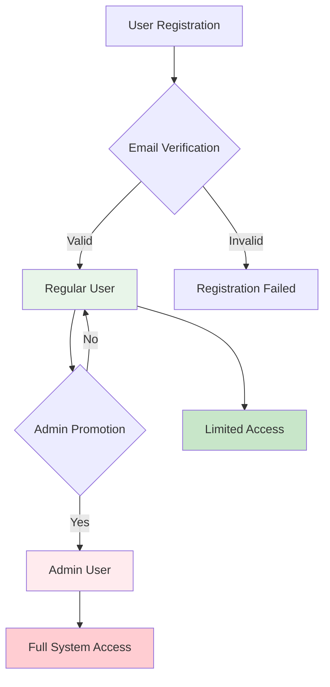

# Users API

User management with registration, authentication, and administrative functions.

## 👥 User Management

### User Roles



## 🔗 Endpoints

### Register User

Register a new user account in the system.

**`POST /auth/register`**

=== "Request"
    ```json
    {
      "email": "newuser@example.com",
      "senha": "securePassword123!",
      "nome": "John Doe"
    }
    ```

=== "Response"
    ```json
    {
      "mensagem": "Usuário criado com sucesso",
      "usuario": {
        "id": 5,
        "email": "newuser@example.com",
        "nome": "John Doe",
        "is_admin": false,
        "data_criacao": "2023-12-01T10:30:00"
      }
    }
    ```

=== "cURL"
    ```bash
    curl -X POST "http://localhost:8000/auth/register" \
      -H "Content-Type: application/json" \
      -d '{
        "email": "newuser@example.com",
        "senha": "securePassword123!",
        "nome": "John Doe"
      }'
    ```

### Get Current User

Get detailed information about the currently authenticated user.

**`GET /auth/me`**

=== "Request"
    ```bash
    # Headers
    Authorization: Bearer <access_token>
    ```

=== "Response"
    ```json
    {
      "id": 5,
      "email": "newuser@example.com",
      "nome": "John Doe",
      "is_admin": false,
      "data_criacao": "2023-12-01T10:30:00",
      "estatisticas": {
        "total_pedidos": 12,
        "pedidos_pendentes": 3,
        "valor_total_gasto": 450.75
      }
    }
    ```

=== "cURL"
    ```bash
    curl -X GET "http://localhost:8000/auth/me" \
      -H "Authorization: Bearer <access_token>"
    ```

### Update User Profile

Update user profile information.

**`PATCH /auth/me`**

=== "Request"
    ```json
    {
      "nome": "John Smith",
      "email": "johnsmith@example.com"
    }
    ```

=== "Response"
    ```json
    {
      "mensagem": "Perfil atualizado com sucesso",
      "usuario": {
        "id": 5,
        "email": "johnsmith@example.com",
        "nome": "John Smith",
        "is_admin": false
      }
    }
    ```

=== "cURL"
    ```bash
    curl -X PATCH "http://localhost:8000/auth/me" \
      -H "Authorization: Bearer <access_token>" \
      -H "Content-Type: application/json" \
      -d '{
        "nome": "John Smith",
        "email": "johnsmith@example.com"
      }'
    ```

### Change Password

Change user password with current password verification.

**`POST /auth/change-password`**

=== "Request"
    ```json
    {
      "senha_atual": "currentPassword123",
      "nova_senha": "newSecurePassword456!"
    }
    ```

=== "Response"
    ```json
    {
      "mensagem": "Senha alterada com sucesso"
    }
    ```

=== "cURL"
    ```bash
    curl -X POST "http://localhost:8000/auth/change-password" \
      -H "Authorization: Bearer <access_token>" \
      -H "Content-Type: application/json" \
      -d '{
        "senha_atual": "currentPassword123",
        "nova_senha": "newSecurePassword456!"
      }'
    ```

## 🔐 Admin Endpoints

!!! warning "Admin Only"
    The following endpoints require administrator privileges.

### List All Users

Get a list of all users in the system (Admin only).

**`GET /auth/users`**

=== "Request"
    ```bash
    # Headers
    Authorization: Bearer <admin_access_token>
    ```

=== "Response"
    ```json
    [
      {
        "id": 1,
        "email": "admin@example.com",
        "nome": "Admin User",
        "is_admin": true,
        "data_criacao": "2023-11-01T08:00:00",
        "ultimo_login": "2023-12-01T09:15:00"
      },
      {
        "id": 5,
        "email": "user@example.com",
        "nome": "Regular User",
        "is_admin": false,
        "data_criacao": "2023-12-01T10:30:00",
        "ultimo_login": "2023-12-01T11:45:00"
      }
    ]
    ```

=== "cURL"
    ```bash
    curl -X GET "http://localhost:8000/auth/users" \
      -H "Authorization: Bearer <admin_access_token>"
    ```

### Get User by ID

Get detailed information about a specific user (Admin only).

**`GET /auth/users/{user_id}`**

=== "Request"
    ```bash
    # URL parameter: user_id
    # Headers: Authorization: Bearer <admin_access_token>
    ```

=== "Response"
    ```json
    {
      "id": 5,
      "email": "user@example.com",
      "nome": "Regular User",
      "is_admin": false,
      "data_criacao": "2023-12-01T10:30:00",
      "ultimo_login": "2023-12-01T11:45:00",
      "estatisticas": {
        "total_pedidos": 12,
        "pedidos_pendentes": 3,
        "pedidos_finalizados": 8,
        "pedidos_cancelados": 1,
        "valor_total_gasto": 450.75
      }
    }
    ```

=== "cURL"
    ```bash
    curl -X GET "http://localhost:8000/auth/users/5" \
      -H "Authorization: Bearer <admin_access_token>"
    ```

### Promote User to Admin

Grant administrator privileges to a user (Admin only).

**`POST /auth/users/{user_id}/promote`**

=== "Request"
    ```bash
    # URL parameter: user_id
    # Headers: Authorization: Bearer <admin_access_token>
    ```

=== "Response"
    ```json
    {
      "mensagem": "Usuário promovido a administrador com sucesso",
      "usuario": {
        "id": 5,
        "email": "user@example.com",
        "nome": "Regular User",
        "is_admin": true
      }
    }
    ```

=== "cURL"
    ```bash
    curl -X POST "http://localhost:8000/auth/users/5/promote" \
      -H "Authorization: Bearer <admin_access_token>"
    ```

### Deactivate User

Deactivate a user account (Admin only).

**`POST /auth/users/{user_id}/deactivate`**

=== "Request"
    ```bash
    # URL parameter: user_id
    # Headers: Authorization: Bearer <admin_access_token>
    ```

=== "Response"
    ```json
    {
      "mensagem": "Usuário desativado com sucesso",
      "usuario_id": 5
    }
    ```

=== "cURL"
    ```bash
    curl -X POST "http://localhost:8000/auth/users/5/deactivate" \
      -H "Authorization: Bearer <admin_access_token>"
    ```

## 📊 User Statistics

### Get System Statistics

Get overall system statistics (Admin only).

**`GET /auth/statistics`**

=== "Response"
    ```json
    {
      "total_usuarios": 25,
      "usuarios_ativos": 22,
      "usuarios_inativos": 3,
      "administradores": 2,
      "usuarios_regulares": 20,
      "registros_hoje": 3,
      "registros_semana": 12,
      "ultimo_registro": "2023-12-01T10:30:00"
    }
    ```

## 🔒 Authorization Matrix

### Permission Levels

| Action | Regular User | Admin User |
|--------|--------------|------------|
| **Register** | ✅ | ✅ |
| **Login/Logout** | ✅ | ✅ |
| **View Own Profile** | ✅ | ✅ |
| **Update Own Profile** | ✅ | ✅ |
| **Change Own Password** | ✅ | ✅ |
| **View All Users** | ❌ | ✅ |
| **View Other User Details** | ❌ | ✅ |
| **Promote Users** | ❌ | ✅ |
| **Deactivate Users** | ❌ | ✅ |
| **System Statistics** | ❌ | ✅ |

### Order Management Permissions

| Action | User (Own Orders) | Admin (All Orders) |
|--------|-------------------|-------------------|
| **Create Orders** | ✅ | ✅ |
| **View Orders** | ✅ Own Only | ✅ All Orders |
| **Modify Orders** | ✅ Own Only | ✅ All Orders |
| **Delete Orders** | ✅ Own Only | ✅ All Orders |

## 🛡️ Security Features

### Password Requirements

!!! info "Password Policy"
    - Minimum 8 characters
    - At least one uppercase letter
    - At least one lowercase letter
    - At least one number
    - At least one special character

### Account Security

- **Password Hashing**: bcrypt with salt
- **Session Management**: JWT tokens
- **Rate Limiting**: Login attempt protection
- **Account Lockout**: After failed attempts
- **Audit Logging**: All admin actions logged

## 🚨 Error Handling

### User Registration Errors

| Error Code | Description | Solution |
|------------|-------------|----------|
| `EMAIL_EXISTS` | Email already registered | Use different email |
| `WEAK_PASSWORD` | Password doesn't meet requirements | Use stronger password |
| `INVALID_EMAIL` | Email format invalid | Check email format |

### Authentication Errors

| Error Code | Description | Solution |
|------------|-------------|----------|
| `INVALID_CREDENTIALS` | Wrong email/password | Check credentials |
| `ACCOUNT_DEACTIVATED` | User account disabled | Contact administrator |
| `TOO_MANY_ATTEMPTS` | Rate limit exceeded | Wait before retrying |

### Authorization Errors

| Error Code | Description | Solution |
|------------|-------------|----------|
| `INSUFFICIENT_PERMISSIONS` | Admin access required | Contact administrator |
| `USER_NOT_FOUND` | User doesn't exist | Check user ID |
| `CANNOT_MODIFY_ADMIN` | Cannot modify admin user | Check permissions |

## 🧪 Testing Examples

### User Registration Flow

```python
import httpx

base_url = "http://localhost:8000"

# 1. Register new user
response = httpx.post(f"{base_url}/auth/register", json={
    "email": "testuser@example.com",
    "senha": "SecurePass123!",
    "nome": "Test User"
})
print("Registration:", response.json())

# 2. Login
response = httpx.post(f"{base_url}/auth/login", json={
    "email": "testuser@example.com",
    "senha": "SecurePass123!"
})
tokens = response.json()
access_token = tokens["access_token"]

# 3. Get user profile
headers = {"Authorization": f"Bearer {access_token}"}
response = httpx.get(f"{base_url}/auth/me", headers=headers)
print("Profile:", response.json())

# 4. Update profile
response = httpx.patch(f"{base_url}/auth/me", 
                      json={"nome": "Updated Name"}, 
                      headers=headers)
print("Update:", response.json())
```

### Admin Operations

```python
# Admin token required
admin_headers = {"Authorization": f"Bearer {admin_token}"}

# List all users
response = httpx.get(f"{base_url}/auth/users", headers=admin_headers)
users = response.json()

# Get system statistics
response = httpx.get(f"{base_url}/auth/statistics", headers=admin_headers)
stats = response.json()

# Promote user to admin
user_id = 5
response = httpx.post(f"{base_url}/auth/users/{user_id}/promote", 
                     headers=admin_headers)
```

---

**Next:** [Frontend Documentation](../frontend/dashboard.md) 🎨