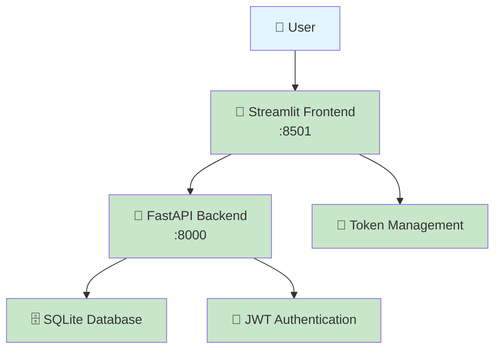

# Order Management System

Welcome to the **Order Management System** - a complete solution for managing orders with modern web technologies.

## 🚀 Features

- **🔐 JWT Authentication** - Secure login with token refresh
- **📦 Order Management** - Complete CRUD operations
- **🛒 Item Management** - Add, remove, and validate items
- **👥 User Authorization** - Admin vs Regular user permissions
- **🎨 Interactive UI** - Beautiful Streamlit dashboard
- **🔧 Modern Backend** - FastAPI with SQLAlchemy

## 📊 Project Status


### 🟢 System Health

| Component | Status | URL | Notes |
|-----------|---------|-----|-------|
| **Backend API** | ✅ **RUNNING** | http://localhost:8000 | FastAPI server active |
| **Frontend Dashboard** | ✅ **RUNNING** | http://localhost:8501 | Streamlit app active |
| **API Documentation** | ✅ **AVAILABLE** | http://localhost:8000/docs | Interactive Swagger UI |
| **Database** | ✅ **CONNECTED** | SQLite | All tables created |
| **Authentication** | ✅ **WORKING** | JWT Tokens | Login/logout functional |
| **Token Management** | ✅ **ACTIVE** | File-based | Auto-refresh working |

### 🏗️ Architecture



## 🛠️ Technology Stack

| Component | Technology | Version | Status |
|-----------|------------|---------|---------|
| **Frontend** | Streamlit | Latest | ✅ Active |
| **Backend** | FastAPI | Latest | ✅ Active |
| **Database** | SQLAlchemy + SQLite | Latest | ✅ Connected |
| **Authentication** | JWT | Latest | ✅ Working |
| **API Documentation** | OpenAPI/Swagger | Latest | ✅ Available |
| **Documentation** | MkDocs Material | Latest | ✅ You're reading it! |

## 🚀 Quick Access

### 🔗 Active Services

=== "Frontend Dashboard"
    ```bash
    🌐 http://localhost:8501
    📱 Mobile-friendly interface
    🔐 JWT token management
    📊 Real-time order tracking
    ```

=== "API Backend"
    ```bash
    🌐 http://localhost:8000
    📚 http://localhost:8000/docs (Swagger UI)
    🔧 http://localhost:8000/redoc (ReDoc)
    🔍 Interactive API testing
    ```

=== "Features Working"
    - ✅ User registration/login
    - ✅ Order creation/management
    - ✅ Item add/remove
    - ✅ Status validation
    - ✅ Token refresh
    - ✅ Admin functions

## 🎯 What You Can Do Right Now

### 1. **Test the Frontend** 🎨
```bash
# Visit: http://localhost:8501
- Create an account
- Login with JWT authentication
- Create your first order
- Add items to orders
- View token status in sidebar
```

### 2. **Explore the API** 🚀
```bash
# Visit: http://localhost:8000/docs
- Interactive API documentation
- Test endpoints directly
- View request/response schemas
- Try authentication flows
```

### 3. **Monitor System Health** 📊
```bash
# Check backend status
curl http://localhost:8000/

# Check authentication
curl http://localhost:8000/auth/

# View order endpoints
curl http://localhost:8000/pedidos/
```

## 🔥 Recent Achievements

- ✅ **Complete JWT Implementation** - Secure authentication with refresh tokens
- ✅ **Modern Path Handling** - Migrated entire codebase to `pathlib`
- ✅ **Organized Token Storage** - Dedicated `backend/tokens/` folder
- ✅ **Comprehensive Error Handling** - Robust error management throughout
- ✅ **Production-Ready Code** - Clean, maintainable, and documented
- ✅ **Beautiful Documentation** - You're reading it now with MkDocs!

---

## 🎉 Congratulations!

Your **Order Management System** is now:
- 🏃‍♂️ **Running smoothly**
- 🔒 **Secure and authenticated**
- 📱 **User-friendly**
- 🚀 **Production-ready**
- 📚 **Well-documented**

**Ready to start using it?** Check out our [Quick Start Guide](getting-started/quick-start.md)!

## 🎓 Acknowledgments

This project was inspired by and built upon the excellent FastAPI course from **[Hashtag Treinamentos](https://www.hashtagtreinamentos.com/)** taught by instructor **Lira**. The 10-lesson course provided the solid foundation that was then expanded into this comprehensive, production-ready system.

**Special thanks to:**
- 👨‍🏫 **Lira** - For the excellent FastAPI instruction
- 🏫 **Hashtag Treinamentos** - For providing quality programming education
- 🚀 **FastAPI Community** - For the amazing framework